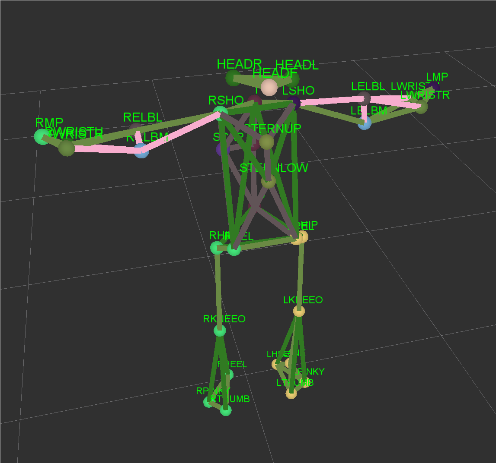

libmocap
========

***This work is distributed under The BSD 3-Clause License.***

libmocap is a C++ library with no dependencies aiming at Motion
Capture Data.

libmocap also includes an *optional* ROS viewer relying on ROS and
ncurses. It can be disabled by setting `ENABLE_ROS_VIEWER` to false.
When the viewer is running, it streams MarkerArray messages which can
then be displayed in rviz.

Supported Formats:

 - Cortex (Motion Analysis) file formats:
   - `*.mars` (Marker Set)
   - `*.trc` (Marker Position / track data)

These loaders have been retro-engineered using the GUI documentation
and there is no guarantee they will work for any file.

## Missing Features

 * Segments Hierarchy not loaded
 * Segments rotation offset not loaded

